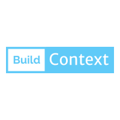

Languages: [English](README.md) | [Brazilian Portuguse](README-pt-BR.md)



# BuildContext

Access most used properties in your `BuildContext` instance.
This package relies on Dart's extension to provide easy access for the most used properties and functions that depends on the `BuildContext` instance.

# Available Extensions
I update this package frequently to add more extensions, 
bellow you can see the currently available extensions in the latest version.

#### From the `MediaQuery`. Access properties right in the `context` instance. Available extensions:

* `context.mediaQuerySize`
* `context.orientation`
* `context.mediaQueryPadding`
* `context.alwaysUse24HourFormat`
* `context.devicePixelRatio`
* `context.platformBrightness`
* `context.textScaleFactor`
* `context.isLandscape`
* `context.isPortrait`
* `context.mediaQueryViewPadding`
* `context.mediaQueryViewInsets`
* `context.mediaQueryShortestSide`


* `context.isPhone`
* `context.isTablet`
* `context.isSmallTablet`
* `context.isLargeTablet`

#### From the `Navigator` class. Navigate with ease. Available extensions:

* `context.push()`
* `context.pop()`
* `context.canPop()`
* `context.pushNamed()`
* `context.popUntil()`

#### From the `Theme` class. Access your themes right in the `context` instance. Available extensions:

* `context.theme`
* `context.textTheme`
* `context.primaryTextTheme`
* `context.accentTextTheme`
* `context.bottomAppBarTheme`
* `context.bottomSheetTheme`
* `context.appBarTheme`
* `context.backgroundColor`
* `context.primaryColor`
* `context.buttonColor`
* `context.scaffoldBackgroundColor`
* `context.platform`
* `context.isAndroid`
* `context.isIOS`
* `context.isWindows`
* `context.isMacOS`
* `context.isLinux`
* `context.isFuchsia`
* `context.headline1`
* `context.headline2`
* `context.headline3`
* `context.headline4`
* `context.headline5`
* `context.headline6`
* `context.subtitle1`
* `context.bodyText1`
* `context.bodyText2`
* `context.caption`
* `context.button`
* `context.subtitle2`
* `context.overline`

#### From `Scaffold` class. Handle your scaffold in their `context`. 
Note: those must be called in the context of a `Scaffold` widget otherwise you might have errors.

* `context.openDrawer()`
* `context.openEndDrawer()`
* `context.showSnackBar()`
* `context.hideCurrentSnackBar()`
* `context.removeCurrentSnackBar()`
* `context.showBottomSheet()`

#### From `Form.of(context)` class.
Note: those must be called in the context of a `Scaffold` widget otherwise you might have errors.

* `context.form.validate()`
* `context.form.reset()`
* `context.form.save()`

#### From `FocusScope.of(context)` class.

* `context.focusScope.hasFocus`
* `context.focusScope.isFirstFocus`
* `context.focusScope.canRequestFocus`
* `context.focusScope.hasPrimaryFocus`

* `context.focusScope.unfocus()`
* `context.focusScope.nextFocus()`
* `context.focusScope.requestFocus()`
* `context.focusScope.previousFocus()`
* `context.focusScope.setFirstFocus()`
* `context.focusScope.consumeKeyboardToken()`
* `context.closeKeyboard()`

#### From `ModalRoute.of(context)` class.

* `context.modalRoute`
* `context.routeSettings`

# Install

Add it in your `pubspec.yaml`:

````yaml
dependencies:
  build_context: ^3.0.0
````

Import it where you want to use it e.g, in your widget's file.

```dart
import "package:build_context/build_context.dart";
```

Here is a usage example:

```dart
import 'package:flutter/material.dart';
import "package:build_context/build_context.dart";

class MyHomePage extends StatelessWidget {
  @override
  Widget build(BuildContext context) {
    return Scaffold(
      backgroundColor: context.scaffoldBackgroundColor, // There is no Theme.of(context)
      body: Center(
        child: GestureDetector(
          onTap: () => context.pushNamed('/detailsPage'), // we use only context not Navigator.of(context)
          child: Text(
            'Press Me',
            style: context.primaryTextTheme.title, // we use only context not Theme.of(context)
          ),
        ),
      ),
    );
  }
}
```

# Support
You liked this package? then give it a star. If you want to help then:

* Start this repository
* Send a Pull Request with new features
* Share this package
* Create issues if you find a Bug or want to suggest something